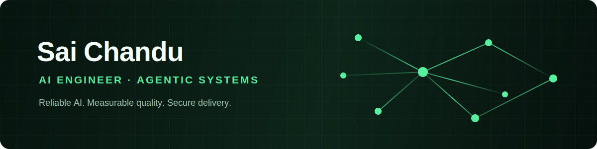

  

  

  Building reliable agentic AI systems for high-stakes, real-world work.

  
  
  

## About me

I’m an AI engineer focused on human-reviewed workflows, LLM evaluation and safety, private edge inference, and cloud-native software delivery.

<pre><code>{
  "building": "deployable agentic AI systems with measurable quality and security controls",
  "specializing_in": ["RAG", "LLM evaluation", "AI security", "offline inference"],
  "engineering_style": "explicit interfaces, observable services, secure defaults",
  "goal_2026": "ship trustworthy AI products with a strong engineering team"
}</code></pre>

## Tech stack

  
  
  
  
  
  
  
  
  

> Build intelligence that teams can understand, trust, and operate.

